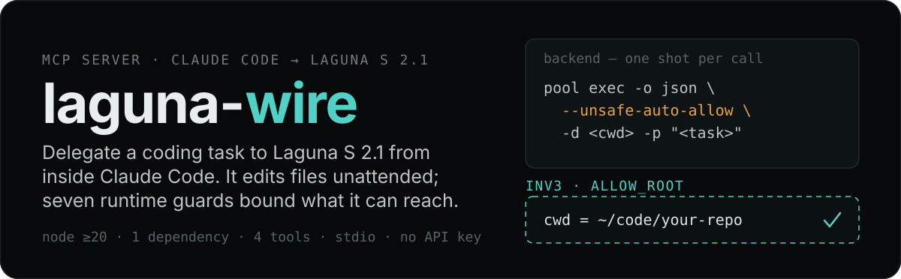
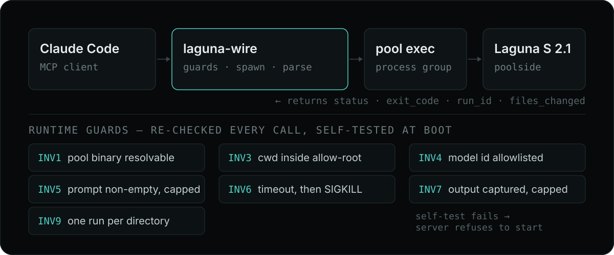

# laguna-wire

<p align="center">
  
</p>

laguna-wire is a stdio MCP server that lets Claude Code delegate a coding task to Laguna S 2.1 (poolside `pool exec`) as an autonomous, auto-approved agent. It spawns `pool exec` in a child process group, parses the NLJSON output, and returns a structured report (status, exit_code, run_id, files_changed). Seven runtime invariants — re-checked on every call and self-tested at boot — validate every call before it spawns, with cwd containment as the security boundary.

## Proof

```
status: ok
exit_code: 0
model: poolside/laguna-s-2.1 (pool account default; not settable via 'pool exec')   cwd: /Users/mikhail/code/my-repo
run_id: 0190a1b2-3c4d-7e8f-9012-34567890abcd (laguna_reply continues from here)
files_changed:
  ?? hello.txt
  M src/lib.ts

--- output ---
Created hello.txt with the requested content.
```

`test/smoke.mjs` drives this end-to-end for real (creates a throwaway git repo, calls `runPool`, asserts `hello.txt` exists and `run_id` is captured). `test/mcp-check.mjs` boots the server over stdio and asserts all 4 tools register.

## What it is

laguna-wire shells out to one backend command per call:

```
pool exec -o json --unsafe-auto-allow -d <cwd> -p "<task>"
```

`laguna_reply` appends `--continue <run-id>` to resume the prior conversation in that cwd. `--unsafe-auto-allow` means pool runs Laguna fully auto-approved — it edits files and runs commands unattended, with no per-action prompt. The mitigation is INV3: `cwd` must be absolute, exist, and — after `realpath` resolution, so symlinks and `..` don't help — resolve inside `LAGUNA_WIRE_ALLOW_ROOT` (default: your home directory). Be clear on what that does and does not buy you. INV3 bounds **where you can point Laguna**; it is not a sandbox. The child runs on the host under your own user and permissions, so nothing here stops it from touching paths outside `cwd`. Treat `LAGUNA_WIRE_ALLOW_ROOT` as a blast-radius setting, not a jail — narrow it to a project tree, and use a real sandbox if you need containment you can rely on.

`pool exec` has no `--model` flag. The model is pool's saved account default (verified `poolside/laguna-s-2.1`). `LAGUNA_WIRE_MODEL` is informational only and is never passed to pool.

## How it works

<p align="center">
  
</p>

## Install

Prerequisites: Node.js ≥ 20, and the `pool` CLI installed and authenticated (`~/.config/poolside/credentials.json`).

```
npm install
node index.mjs --selfcheck   # expect: laguna-wire: all guard self-tests passed
node index.mjs --checkbin    # expect: laguna-wire: backend resolved -> /abs/path/to/pool
```

Register with Claude Code as a stdio MCP server:

```
claude mcp add laguna-wire --transport stdio -- node /abs/path/index.mjs
```

Or add the config manually:

```json
{
  "mcpServers": {
    "laguna-wire": {
      "command": "node",
      "args": ["/abs/path/index.mjs"]
    }
  }
}
```

## Tools

| Tool | What it does | Required params | Optional params |
|---|---|---|---|
| `laguna_implement_plan` | Delegate a coding task/plan to Laguna S 2.1 (one-shot, auto-approve) | `prompt`, `cwd` | `timeout_s` |
| `laguna_reply` | Continue the most recent conversation in cwd (`pool exec --continue`) | `user_input`, `cwd` | `timeout_s` |
| `laguna_cancel` | Kill any in-flight run for cwd (SIGTERM the process group) | `cwd` | — |
| `laguna_status` | Report in-flight runs (all, or for one cwd) | — | `cwd` |

## Configuration

| Env var | Default | Meaning |
|---|---|---|
| `LAGUNA_WIRE_BIN` | `pool` | Backend binary name or absolute path |
| `LAGUNA_WIRE_MODEL` | `poolside/laguna-s-2.1` | Informational model id (not passed to pool) |
| `LAGUNA_WIRE_ALLOW_ROOT` | home directory | Allowed root that cwd must be contained within |
| `LAGUNA_WIRE_MODEL_RE` | `^poolside/` | Regex the model id must match (sanity check) |
| `LAGUNA_WIRE_SESSIONS_DIR` | `~/Library/Application Support/poolside/sessions` | Directory scanned for newest session file to capture run_id |

## Guards

| Invariant | What it enforces | When checked |
|---|---|---|
| INV1 | Backend binary (`pool`) resolvable to an absolute path | Per call, at start of `runPool` |
| INV3 | cwd is absolute, exists, is a directory, and is contained inside `LAGUNA_WIRE_ALLOW_ROOT` | Per call |
| INV4 | Model id matches the allowlist regex | Per call (informational) |
| INV5 | Prompt is non-empty and under 200k chars | Per call |
| INV6 | Timeout clamped to 30..3600s; SIGTERM then SIGKILL after 5s | Per call |
| INV7 | Output captured with a 2MB size cap | Per call |
| INV9 | Single-flight per cwd (no concurrent runs) | Per call |

INV2 and INV8 are intentionally absent. Unlike the glm/qwen wire siblings, no API key flows through this wrapper — `pool` authenticates itself via `~/.config/poolside/credentials.json`, and no secret appears on the child's stdout. The scrub/no-leak layer is therefore deliberately not implemented.

## Limits

- Prompt cap: 200,000 chars. Passed as a CLI arg (`-p`), not stdin — bounded by `ARG_MAX`.
- Output retention cap: 2,000,000 bytes of captured stdout+stderr.
- Timeout: clamped to 30..3600s, default 1800s.
- Single-flight per cwd: a second call to the same cwd while one is running is rejected.
- `run_id` is captured by the newest-session-file heuristic (newest `session-*.json` in `LAGUNA_WIRE_SESSIONS_DIR` created after the run started). Can misattribute if two runs in different cwds finish in the same instant.
- `files_changed` is empty when cwd is not a git repo.
- Model is not settable per call — `pool exec` has no `--model` flag.

## Tests

```
node test/mcp-check.mjs                                     # boots server over stdio, asserts 4 tools register
LAGUNA_SMOKE_ROOT=/path/to/dir node test/smoke.mjs          # live end-to-end (needs pool + auth)
```

`smoke.mjs` requires `LAGUNA_SMOKE_ROOT` (a directory that will contain a throwaway `laguna-smokerepo` git repo) and a working, authenticated `pool`.

## License

Not yet licensed. Add one before reuse.
